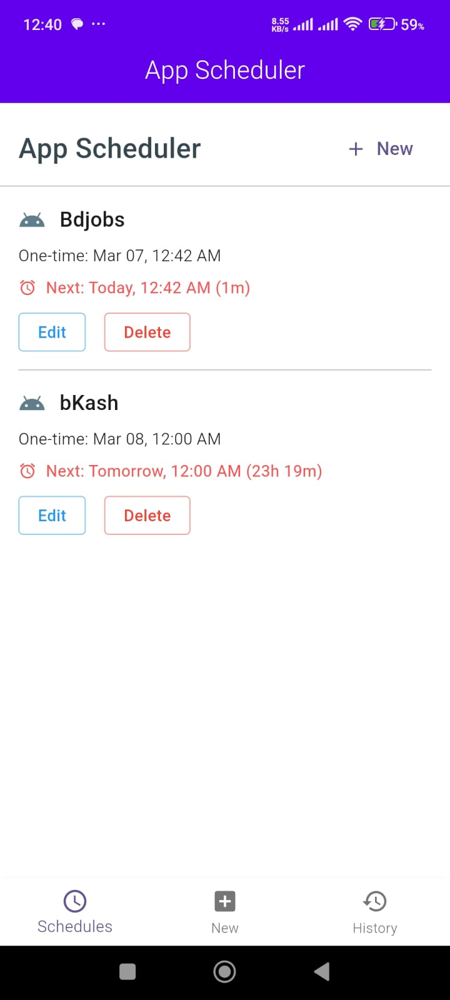
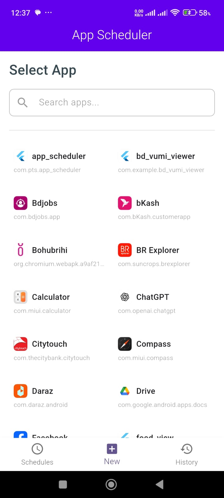
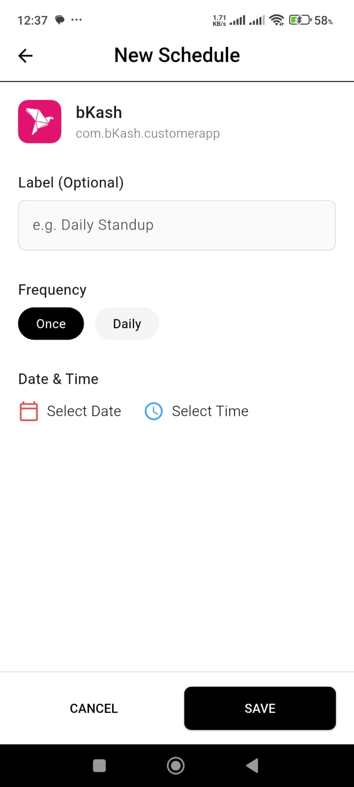
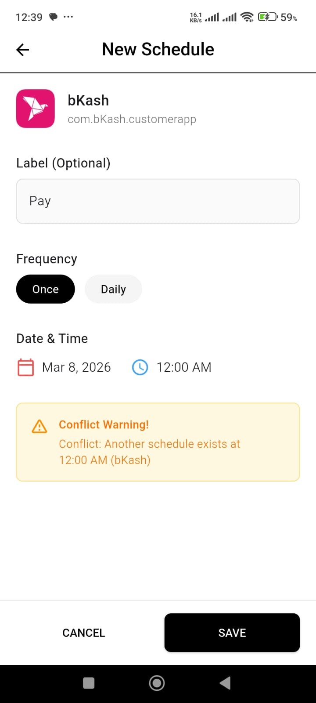

# 🕒 TMS InTask - App Scheduler

**TMS InTask** is a powerful and production-ready Flutter application built with **Clean Architecture** and **Riverpod**. It allows users to schedule any installed Android application to launch automatically at a specific time, even if the device is locked or the app is closed.

---

## 📺 App Demo

<div align="center">
  <video src="assets/video/schedule_app.mp4" width="400" controls>
    Your browser does not support the video tag.
  </video>
</div>

---

## 📸 Screenshots

<div align="center">
  <table>
    <tr>
      <td width="25%"><b>Main Schedule</b><br/></td>
      <td width="25%"><b>App Selection</b><br/></td>
      <td width="25%"><b>Setup Alarm</b><br/></td>
      <td width="25%"><b>Conflict Detection</b><br/></td>
    </tr>
  </table>
</div>

---

## 🚀 Key Features

- **📱 App Discovery:** Automatically lists all installed apps with a quick search feature.
- **⏰ Smart Scheduling:** Schedule any app to launch at a precise date and time.
- **🔄 Recurring Tasks:** Support for one-time and daily recurring schedules.
- **🛡️ Conflict Detection:** Prevents scheduling multiple apps at the exact same second to ensure reliability.
- **📜 Execution History:** Maintain a detailed log of successful and failed app launches.
- **⚙️ Background Execution:** Uses **Android AlarmManager** to trigger events even when the app is killed or the phone is rebooted.
- **🎨 Modern UI:** Built with Material 3 design principles for a smooth user experience.

---

## 🏗️ Architecture & Tech Stack

This project follows **Clean Architecture** (Domain, Data, Presentation layers) to ensure scalability and maintainability.

- **State Management:** `flutter_riverpod`
- **Local Database:** `hive` & `hive_flutter` (NoSQL)
- **Background Tasks:** `android_alarm_manager_plus`
- **App Interaction:** `device_apps`
- **Functional Programming:** `dartz` (for Either/Failure handling)
- **Dependency Injection:** Handled via Riverpod Providers.

---

## 🛠️ Installation & Setup

1. **Clone the repository:**
   ```bash
   git clone https://github.com/your-username/tms_intask.git
   ```

2. **Install dependencies:**
   ```bash
   flutter pub get
   ```

3. **Run Build Runner (if needed):**
   ```bash
   flutter pub run build_runner build --delete-conflicting-outputs
   ```

4. **Run on Android:**
   *Make sure an Android device/emulator is connected.*
   ```bash
   flutter run
   ```

---

## ⚠️ Permissions

To work correctly on Android 12+, the app requires:
- `SCHEDULE_EXACT_ALARM`
- `USE_EXACT_ALARM`
- `RECEIVE_BOOT_COMPLETED` (to reschedule alarms after phone reboot)

---

## 📝 License

This project is licensed under the MIT License - see the [LICENSE](LICENSE) file for details.
